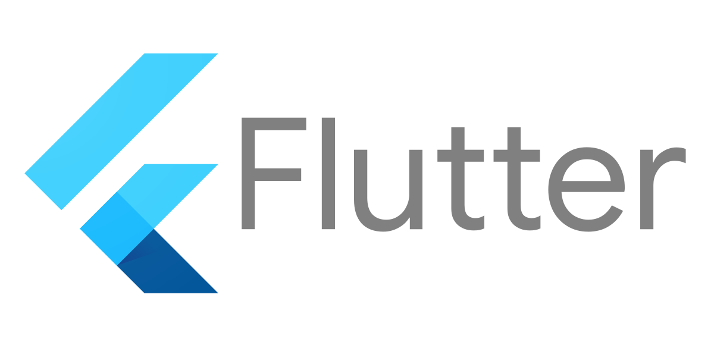
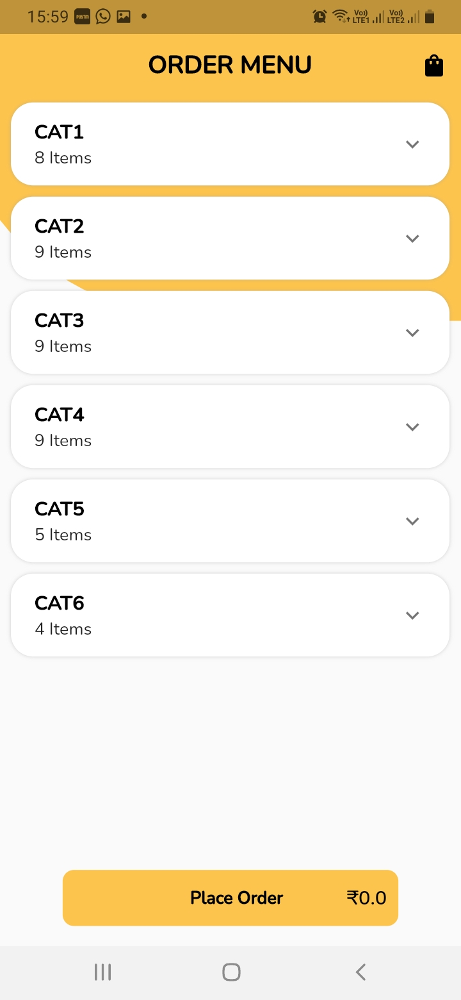
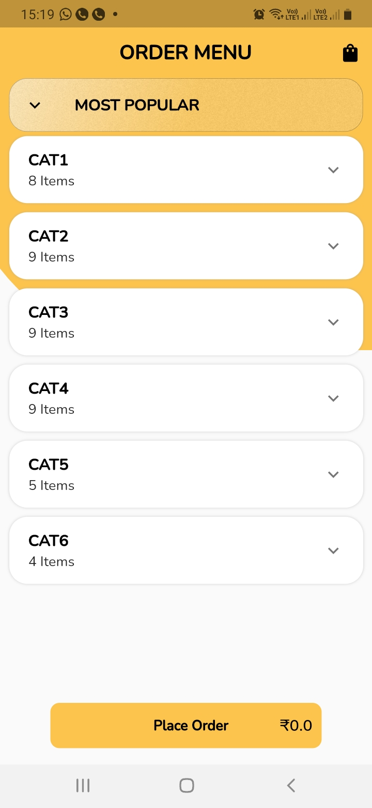
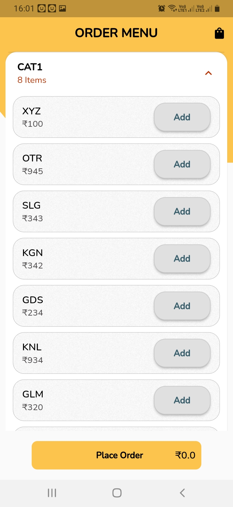
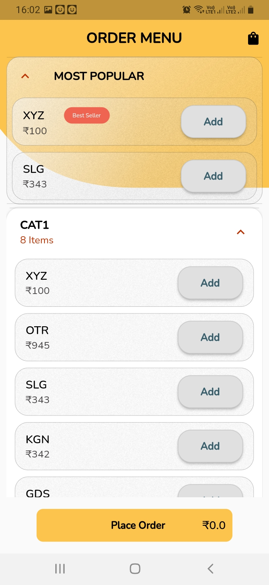
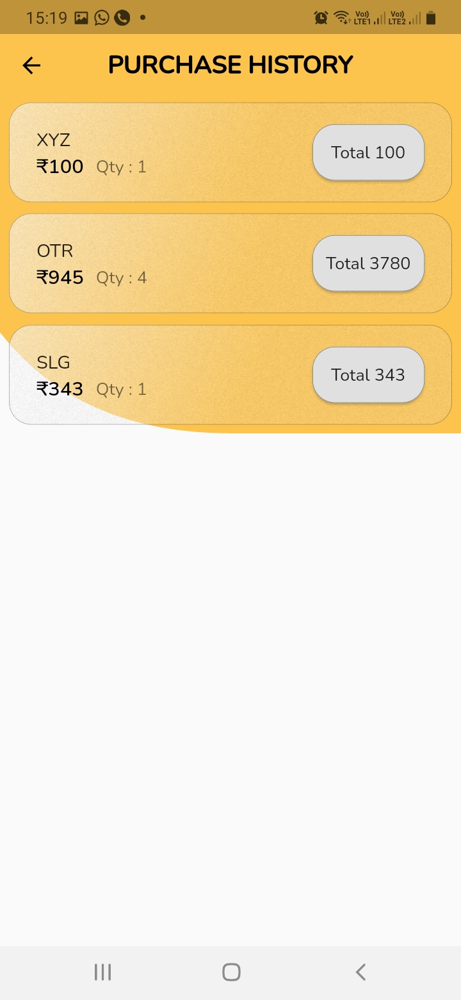
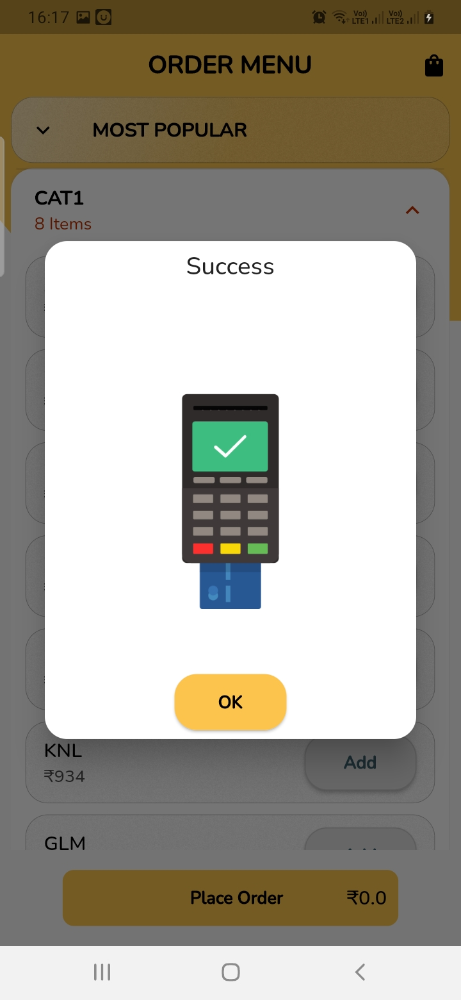

  
  <h1>RESTRO PRO </h1>
  
  

   AN APP T0 PLACE AN ORDER FOR A RESTAURANT:
   [WITH HISTORY]
  

  
  
<!-- Badges -->

 

 

<!-- Table of Contents -->
# DOCREA FUNCTIONALITIES

- ## PACKAGES USED
  - Hive(Local Storage)
  - Get (Getx State Management)
  - Equatable (Data Class)
  - Flutter_staggered_animations
  - Flutter_screenutil

 
  <!-- About the Project -->
    
 
  ## FUNCTIONALITIES
  - View Category 
  - View Product Count (instock/out of stock)
  - View Products (Sorted by category)
  - Add/Remove Products (On decrement quantity product will remove from cart)
  - View Most Popular Products
  - View Most Purchased Product (Best Seller)
  - Place Order
  - View Order History
  - Custom Paintined UI
  - Custom Animations
## ADDITIONAL INFO
  - ##FOR APK  PLEASE LOOK IN TO REPOSITORY "ANDROIDAPK" FOLDER ( NB: PLEASE REMOVE "ANDROIDAPK" FOLDER WHEN YOU CLONE THE REPOSITORY)
   
 

  

<!-- About the Project -->
## :star2: About the Project

<!-- Screenshots -->
### :camera: Screenshots

 
  

 
  

 
  

 
  

 
  

 
  

